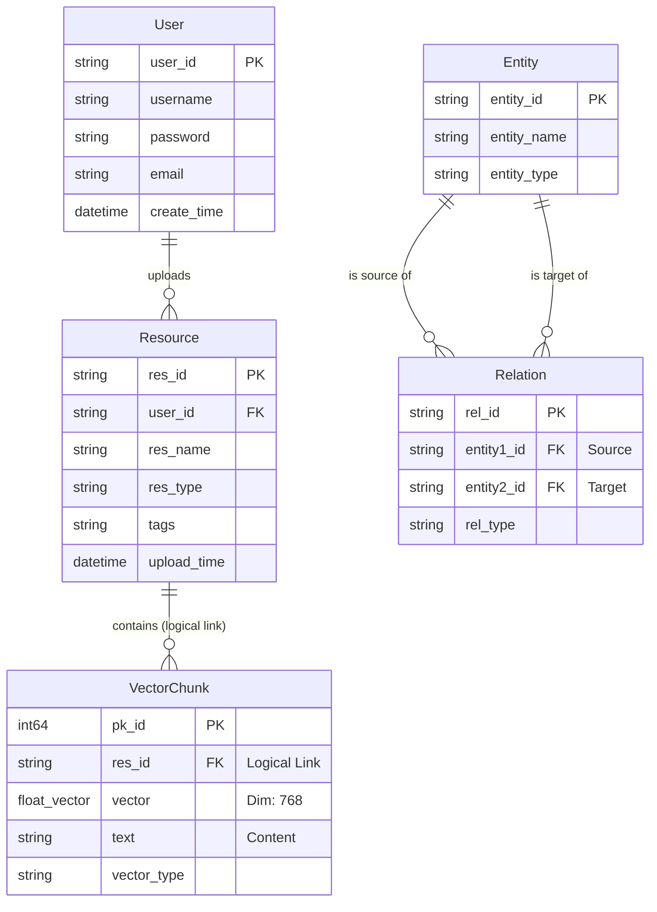

# 系统概念数据模型 (E-R 图)

```mermaid
erDiagram
    %% 关系型数据库 (OpenGauss)
    User ||--o{ Resource : "uploads"
    Resource ||--o{ VectorChunk : "contains (logical link)"
    
    Entity ||--o{ Relation : "is source of"
    Entity ||--o{ Relation : "is target of"

    %% 实体定义
    User {
        string user_id PK
        string username
        string password
        string email
        datetime create_time
    }

    Resource {
        string res_id PK
        string user_id FK
        string res_name
        string res_type
        string tags
        datetime upload_time
    }

    Entity {
        string entity_id PK
        string entity_name
        string entity_type
    }

    Relation {
        string rel_id PK
        string entity1_id FK "Source"
        string entity2_id FK "Target"
        string rel_type
    }

    %% 向量数据库 (Milvus)
    VectorChunk {
        int64 pk_id PK
        string res_id FK "Logical Link"
        float_vector vector "Dim: 768"
        string text "Content"
        string vector_type
    }
```
